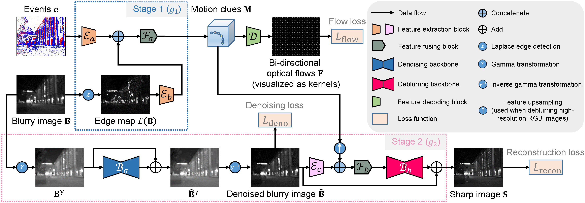

# Deblurring Low-Light Images with Events

By [Chu Zhou](https://fourson.github.io/), Minggui Teng, Jin Han, Jinxiu Liang, Chao Xu, Gang Cao, [Boxin Shi](http://ci.idm.pku.edu.cn/)


[PDF](https://link.springer.com/article/10.1007/s11263-023-01754-5) | [SUPP](https://ci.idm.pku.edu.cn/Zhou_IJCV23.pdf)

## Abstract
Modern image-based deblurring methods usually show degenerate performance in low-light conditions since the images often contain most of the poorly visible dark regions and a few saturated bright regions, making the amount of effective features that can be extracted for deblurring limited. In contrast, event cameras can trigger events with a very high dynamic range and low latency, which hardly suffer from saturation and naturally encode dense temporal information about motion. However, in low-light conditions existing event-based deblurring methods would become less robust since the events triggered in dark regions are often severely contaminated by noise, leading to inaccurate reconstruction of the corresponding intensity values. Besides, since they directly adopt the event-based double integral model to perform pixel-wise reconstruction, they can only handle low-resolution grayscale active pixel sensor images provided by the DAVIS camera, which cannot meet the requirement of daily photography. In this paper, to apply events to deblurring low-light images robustly, we propose a unified two-stage framework along with a motion-aware neural network tailored to it, reconstructing the sharp image under the guidance of high-fidelity motion clues extracted from events. Besides, we build an RGB-DAVIS hybrid camera system to demonstrate that our method has the ability to deblur high-resolution RGB images due to the natural advantages of our two-stage framework. Experimental results show our method achieves state-of-the-art performance on both synthetic and real-world images.

## Prerequisites
* Linux Distributions (tested on Ubuntu 20.04).
* NVIDIA GPU and CUDA cuDNN
* Python >= 3.7
* Pytorch >= 1.10.0
* cv2
* numpy
* tqdm
* tensorboardX (for training visualization)

## About the data used for evaluation
* We provide the [data](https://drive.google.com/drive/folders/1Cyz8ecUnx2xkDzf-KL6FMs2BbSeKZ6V3?usp=sharing) used for evaluation in our paper, including three folders:
  * `test`: containing the test dataset used in our paper (Synthetic APS data)
  * `real`: containing the real data captured by an DAVIS346 event camera (Real APS data)
  * `hybrid`: containing the real data captured by our RGB-DAVIS hybrid camera system (Hybrid camera data)
* Run `mkdir data` first
* Please put the downloaded folders (`test`, `real`, and `hybrid`) into the `data` folder
* Details about the evaluation can be found in the paper
* Note that all deblurring results of hybrid camera data shown in the paper were non-linearized using the script `gamma.py` (provided in the above data link) for better visualization

## About the data used for training the network
* Since the dataset used for training the network is too large, we only provide the [source files](https://drive.google.com/drive/folders/1kHUmemq41GWou8231wEUhJ2Eiq2lJdWA?usp=share_link). Please make the training dataset on your own using our scripts as follows:
  * Run `mkdir -p RealBlurSourceFiles data/train` first
  * Please put the downloaded files (all `*.png` files, which are extracted from the [RealBlur dataset](http://cg.postech.ac.kr/research/realblur/) and linearized) into the `RealBlurSourceFiles` folder
  * Run `python scripts/make_dataset.py` or `python scripts/make_dataset_multiprocessing.py`
    * `make_dataset_multiprocessing.py` could be much faster than `make_dataset.py` if you have multiple CPU cores
    * This step could be quite long (usually few days)
* Details about the synthetic dataset generation pipeline can be found in the paper

## Pre-trained models
* We provide the [pre-trained models](https://drive.google.com/drive/folders/1B0fx2tHtxEjWk7ON1aKLKNDl-Ogjck1e?usp=share_link) for inference
* Run `mkdir checkpoint` first
* Please put the downloaded files (`final.pth` and `final_rgb.pth`) into the `checkpoint` folder

## Inference
* Synthetic APS data:
```
python execute/infer_full.py -r checkpoint/final.pth --rgb 0 --data_dir data/test --result_dir <path_to_result> --data_loader_type InferDataLoader default
```
* Real APS data:
```
python execute/infer_full.py -r checkpoint/final.pth --rgb 0 --data_dir data/real --result_dir <path_to_result> --data_loader_type InferRealDataLoader default
```
* Hybrid camera data:
```
python execute/infer_full.py -r checkpoint/final_rgb.pth --rgb 1 --data_dir data/hybrid --result_dir <path_to_result> --data_loader_type InferRealDataLoader default
```

## Training your own model
* APS data:
```
python execute/train.py -c config/full.json
```
* Hybrid camera data (requiring GPUs with large memory):
```
python execute/train.py -c config/full_rgb.json
```

Note that all config files (`config/*.json`) and the learning rate schedule function (MultiplicativeLR) at `get_lr_lambda` in `utils/util.py` could be edited

## Citation
If you find this work helpful to your research, please cite:
```
@article{zhou2023deblurring,
  title={Deblurring Low-Light Images with Events},
  author={Zhou, Chu and Teng, Minggui and Han, Jin and Liang, Jinxiu and Xu, Chao and Cao, Gang and Shi, Boxin},
  journal={International Journal of Computer Vision},
  volume={131},
  number={5},
  pages={1284--1298},
  year={2023}
}
```